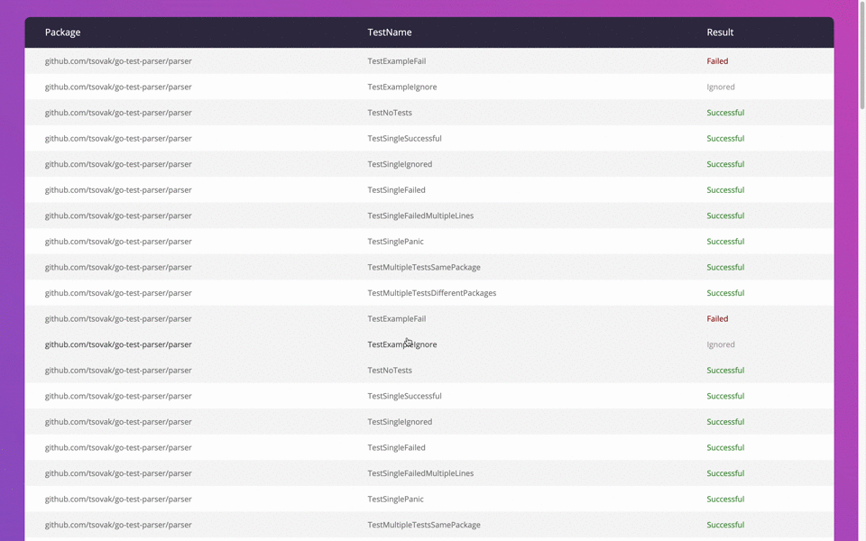

#  Beautify the Golang test output

License: [MIT License](./LICENSE)


## Introduction

This is the CLI fot make go test output more readable. 
The CLI aggregate all mixed test output and displays the tests with their output.

### Requirements

    1. Go 1.13 
    2. Make
    
## Build

Run the command in the project base dir 

    make build 

## Install 
```bash
$ go get github.com/tsovak/go-test-parser/...
$ go-test-parser -h
$ go-runner help
```

    
## Usage 

```bash
go-test-parser is a simple CLI tool for generating the UI report from go test output

Usage:
  ./go-test-parser <go test -json -v output> [flags]

Examples:
./go-test-parser ./test.log -v
 go test -json -v ./... | go-test-parser -o ./report_directory

Flags:
  -h, --help               Help for application
      --http int32         HTTP address to serve (default 8080)
  -s, --includeSucceeded   Include the successful test results or not
  -o, --output string      The report output directory (default "./report")
  -v, --verbose            Print verbose output
  -w, --web                Start only web serer for report displaying
```

1. Generate report to directory: `go-test-parser -o ./report_directory test.log`
2. Generate report and display in the browser via url http://localhost/report: `go-test-parser  -w --http 80 test.log`

------ 

```
go-runner is a simple tool to override the go application and beautify the report. go-runner accepts the `go` arguments and environment variables.
go-runner generate a report only with `--json` flag.

Usage:
    go-runner <command> [arguments]

Example 1:
➜  go-runner version
go version go1.14.3 darwin/amd64

Example 2:
➜  go-runner env
GO111MODULE=""
GOARCH="amd64"
GOBIN=""
... 

Example 3: Here the example where tests were run and failed in the end. The go-runner exit code is the same as go test exit code.
✗ ./bin/go-runner test -v ./cmd/go-runner/test/... -race -json -tags fake
{"Time":"2020-08-31T00:52:00.696202+03:00","Action":"run","Package":"github.com/tsovak/go-test-parser/cmd/go-runner/test","Test":"TestFakeSucceed"}
{"Time":"2020-08-31T00:52:00.696531+03:00","Action":"output","Package":"github.com/tsovak/go-test-parser/cmd/go-runner/test","Test":"TestFakeSucceed","Output":"=== RUN   TestFakeSucceed\n"}
{"Time":"2020-08-31T00:52:00.69659+03:00","Action":"output","Package":"github.com/tsovak/go-test-parser/cmd/go-runner/test","Test":"TestFakeSucceed","Output":"    TestFakeSucceed: fake_test.go:10: I'm robot\n"}
{"Time":"2020-08-31T00:52:00.696608+03:00","Action":"output","Package":"github.com/tsovak/go-test-parser/cmd/go-runner/test","Test":"TestFakeSucceed","Output":"--- PASS: TestFakeSucceed (0.00s)\n"}
{"Time":"2020-08-31T00:52:00.696615+03:00","Action":"pass","Package":"github.com/tsovak/go-test-parser/cmd/go-runner/test","Test":"TestFakeSucceed","Elapsed":0}
{"Time":"2020-08-31T00:52:00.696653+03:00","Action":"run","Package":"github.com/tsovak/go-test-parser/cmd/go-runner/test","Test":"TestFakeFail"}
{"Time":"2020-08-31T00:52:00.696693+03:00","Action":"output","Package":"github.com/tsovak/go-test-parser/cmd/go-runner/test","Test":"TestFakeFail","Output":"=== RUN   TestFakeFail\n"}
{"Time":"2020-08-31T00:52:00.696727+03:00","Action":"output","Package":"github.com/tsovak/go-test-parser/cmd/go-runner/test","Test":"TestFakeFail","Output":"    TestFakeFail: fake_test.go:14: the fake fail test output\n"}
{"Time":"2020-08-31T00:52:00.696744+03:00","Action":"output","Package":"github.com/tsovak/go-test-parser/cmd/go-runner/test","Test":"TestFakeFail","Output":"--- FAIL: TestFakeFail (0.00s)\n"}
{"Time":"2020-08-31T00:52:00.696749+03:00","Action":"fail","Package":"github.com/tsovak/go-test-parser/cmd/go-runner/test","Test":"TestFakeFail","Elapsed":0}
{"Time":"2020-08-31T00:52:00.696766+03:00","Action":"run","Package":"github.com/tsovak/go-test-parser/cmd/go-runner/test","Test":"TestFakeIgnore"}
{"Time":"2020-08-31T00:52:00.696779+03:00","Action":"output","Package":"github.com/tsovak/go-test-parser/cmd/go-runner/test","Test":"TestFakeIgnore","Output":"=== RUN   TestFakeIgnore\n"}
{"Time":"2020-08-31T00:52:00.696791+03:00","Action":"output","Package":"github.com/tsovak/go-test-parser/cmd/go-runner/test","Test":"TestFakeIgnore","Output":"    TestFakeIgnore: fake_test.go:19: the fake test output\n"}
{"Time":"2020-08-31T00:52:00.696844+03:00","Action":"output","Package":"github.com/tsovak/go-test-parser/cmd/go-runner/test","Test":"TestFakeIgnore","Output":"--- SKIP: TestFakeIgnore (0.00s)\n"}
{"Time":"2020-08-31T00:52:00.696962+03:00","Action":"skip","Package":"github.com/tsovak/go-test-parser/cmd/go-runner/test","Test":"TestFakeIgnore","Elapsed":0}
{"Time":"2020-08-31T00:52:00.69697+03:00","Action":"output","Package":"github.com/tsovak/go-test-parser/cmd/go-runner/test","Output":"FAIL\n"}
{"Time":"2020-08-31T00:52:00.69816+03:00","Action":"output","Package":"github.com/tsovak/go-test-parser/cmd/go-runner/test","Output":"FAIL\tgithub.com/tsovak/go-test-parser/cmd/go-runner/test\t0.074s\n"}
{"Time":"2020-08-31T00:52:00.698207+03:00","Action":"fail","Package":"github.com/tsovak/go-test-parser/cmd/go-runner/test","Elapsed":0.075}
report was generated in /Users/tsovak/go/src/github.com/tsovak/go-test-parser/.reports/report_20200831_005200
```

1. `go-runner <command> [arguments]`

### Use in your CI workflows

The CLI is used on the Github Action workflows in this repository. 
See "Generate report" action step for more information.


###### Demo


